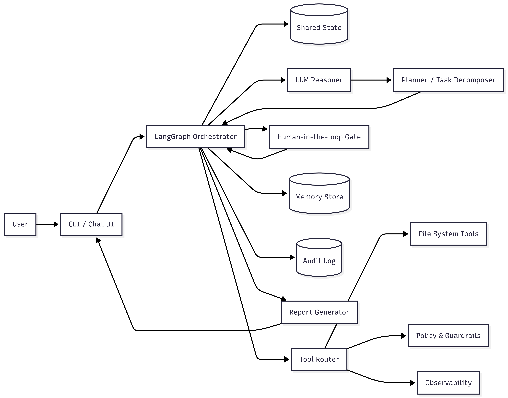

# PC Downloads Cleanup Agent (LangGraph)

A local, LangGraph-powered agentic workflow that safely automates real PC tasks with human oversight.

## Architecture



## Install (Dev Mode)

```powershell
python -m venv .venv
.venv\Scripts\Activate.ps1
pip install -U pip
pip install -e .
```

**Defaults**

* **Human-in-the-loop:** enabled by default
* **Full autonomy:** `--apply --yes`

---

## How to Run (PowerShell)

From your activated virtual environment:

### Dry Run (no changes applied)

```powershell
pc-agent --dry-run "Clean up my Downloads: archive installers older than 30 days and show big files > 1GB"
```

### Apply with One Confirmation Prompt

```powershell
pc-agent --apply "Clean up my Downloads: archive installers older than 30 days and show big files > 1GB"
```

### Apply with Per-Action Selection (Interactive)

```powershell
pc-agent --apply --interactive "Clean up my Downloads: archive installers older than 30 days and show big files > 1GB"
```

### Apply with No Prompts (Full Autonomy)

```powershell
pc-agent --apply --yes "Clean up my Downloads: archive installers older than 30 days and show big files > 1GB"
```

---

## Reports

Markdown reports are saved under:

```text
./reports/
```

Each run produces an auditable record of:

* detected files
* proposed actions
* approved actions
* executed results

---

## Reinstall Cleanly (Important)

From the repo root:

```powershell
deactivate   # if needed
rmdir /s /q .venv
python -m venv .venv
.venv\Scripts\Activate.ps1
pip install -U pip
pip install -e .
```

Then verify:

```powershell
pc-agent --help
pc-agent "Clean up my Downloads: archive installers older than 30 days and show big files > 1GB"
```

---

✅ AI Agent

Because it:

* Accepts a goal in natural language
* Reasons about steps
* Uses tools (filesystem, OS actions)
* Produces actions + reports

✔️ That’s an agent.

✅ Agentic AI

* Decides what to do next
* Maintains state (files found, actions taken)
* Can loop, branch, and reflect
* Operates semi-autonomously with guardrails

✔️ That makes it agentic, not just scripted automation.

✅ Agentic Workflow

* Follows a multi-step process
* Has clear stages (analyze → plan → act → report)
* Supports human-in-the-loop
* Is repeatable, auditable, and safe
* Is implemented as a LangGraph state machine

✔️ That makes it agentic workflow.

---

## Automation (Optional)

### Windows Task Scheduler (Recommended)

You can schedule the agent to run:

* daily
* weekly
* monthly

With any desired autonomy level (`--dry-run`, `--apply`, or `--apply --yes`).

---
